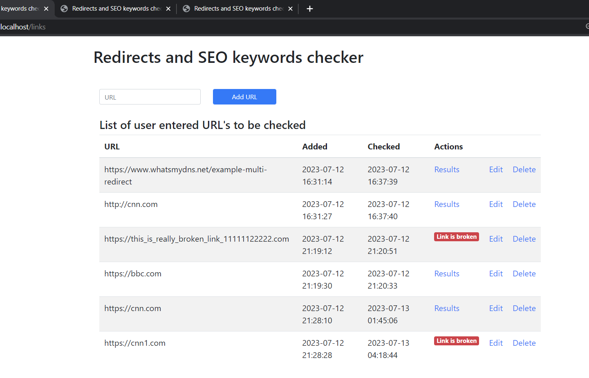
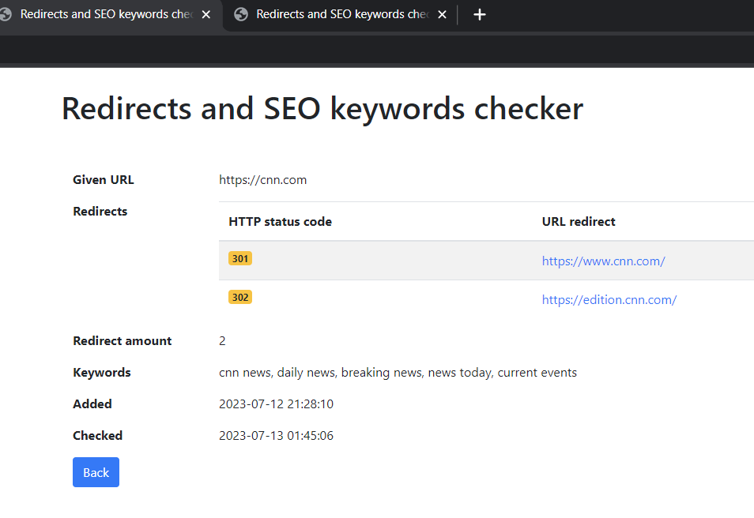

# Link checker app

----------

## Setup
- `git clone https://github.com/arvydux/link-checker.git
- `cd link-checker`
- `docker-compose up -d`
- `docker exec app composer install`
- `cp .env.example .env`
- `docker-compose exec app php artisan migrate`
- `docker-compose exec app php artisan key:generate`

Now that all containers are up, access `localhost.links` on your favorite browser

## Questions and Improvements

For any question or emprovement please send an e-mail to Arvydas Kavalia [shady@veloxsolutions.ca](mailto:arvydas.kavaliauskas83@gmail.com).
